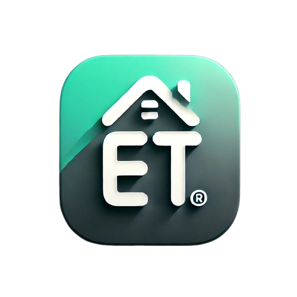

# TE-app

[](https://github.com/BetterAndroid/android-app-template/blob/main/LICENSE)
[](https://t.me/BetterAndroid)
[](https://t.me/HighCapable_Dev)
[](https://qm.qq.com/cgi-bin/qm/qr?k=Pnsc5RY6N2mBKFjOLPiYldbAbprAU3V7&jump_from=webapi&authKey=X5EsOVzLXt1dRunge8ryTxDRrh9/IiW1Pua75eDLh9RE3KXE+bwXIYF5cWri/9lf)



A template for quickly creating basic Android project.

## What's this

This is a template for quickly creating a basic Android project.

Through this template, you can quickly create a clean and concise standard Android project.

The template automatically integrates the [BetterAndroid](https://github.com/BetterAndroid/BetterAndroid) dependency for you, which can help make your development easier.

If you need to use the Jetpack Compose development methods, please refer to another template [android-compose-app-template](https://github.com/BetterAndroid/android-compose-app-template).

## License

- [Apache-2.0](https://www.apache.org/licenses/LICENSE-2.0)

```
Apache License Version 2.0

Copyright (C) 2019-2024 HighCapable

Licensed under the Apache License, Version 2.0 (the "License");
you may not use this file except in compliance with the License.
You may obtain a copy of the License at

    https://www.apache.org/licenses/LICENSE-2.0

Unless required by applicable law or agreed to in writing, software
distributed under the License is distributed on an "AS IS" BASIS,
WITHOUT WARRANTIES OR CONDITIONS OF ANY KIND, either express or implied.
See the License for the specific language governing permissions and
limitations under the License.
```

Copyright © 2019-2024 HighCapable
